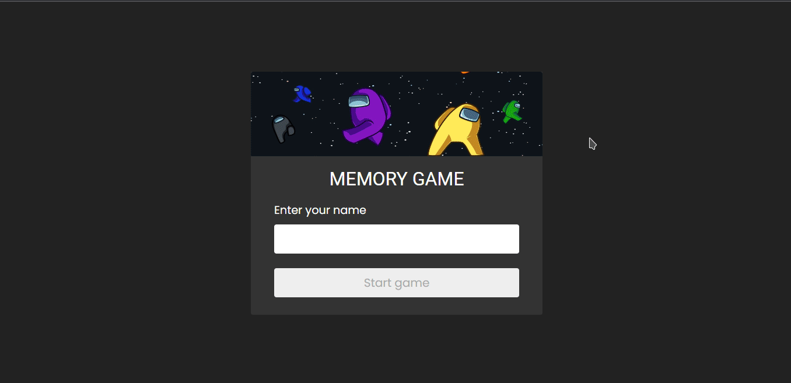

# Jogo da Memória com tema do Among Us

## 📌 Sobre

Projeto realizado para colocar em prática principalmente meus conhecimentos em JavaScript, onde pude utlizar funções, eventos e manipular o HTML atráves do DOM. Além de praticar meu HTML e CSS para que seja responsivo e agradável ao usuário.



## 📚 Aprendizado

<h3>HTML</h3>
<h3>CSS</h3>
<h3>JavaScript</h3>
<ul>
  <li>Manipulação do DOM</li>
  <li>Eventos</li>
  <li>Funções</li>
  <li>Arrays</li>
  <li>Objetos</li>
</ul>

### Criação de Elementos

```js
const createCard = (character) => {
  const card = createElement("div", "card");
  const front = createElement("div", "face front");
  const back = createElement("div", "face back");

  front.style.backgroundImage = `url('../img/${character}.png')`;
  front.style.backgroundSize = `cover`;

  card.appendChild(front);
  card.appendChild(back);

  card.addEventListener("click", revealCard);

  card.setAttribute("data-character", character);

  return card;
};
```

### Cards em ordem aleatória

```js
const loadGame = () => {
  const duplicateCharacters = [...characters, ...characters];

  const shuffleArray = duplicateCharacters.sort(() => Math.random() - 0.5);

  shuffleArray.forEach((character) => {
    const card = createCard(character);
    grid.appendChild(card);
  });
};
```

## Link do site

### [Clique aqui](https://raphaelbaccega.github.io/memory-game/)

---

Made with 💙 by Raphael Baccega 👋 [My LinkedIn](https://www.linkedin.com/in/raphael-couto-baccega/)
